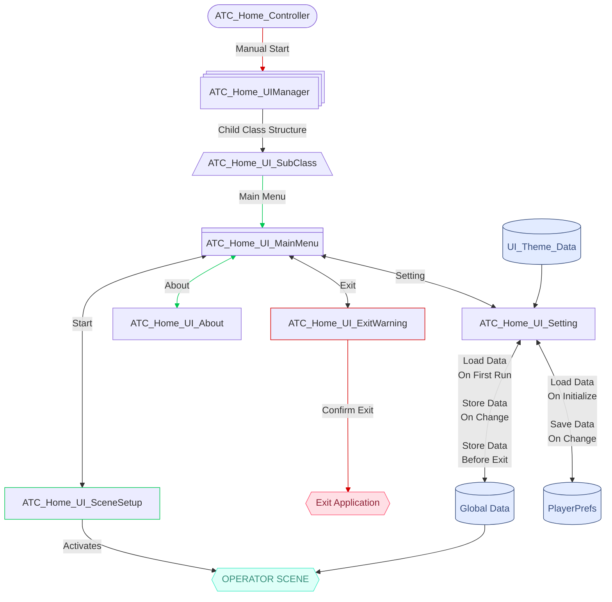

> <h1 style="text-align: center;">BAF ATC SIMULATOR</h1>

> <h2 style="text-align: center;">Operator PC</h2>
---
> <h2 style="text-align: center;">ATC_Home_Scene</h2>
> <h3 style="text-align: center;">Script Relation Flow Chart</h3>

---
> <h3 style="text-align: center;">Script_Link</h3>
* [ATC_Home_Controller](./ATC_Home_Controller.cs)
    * [ATC_Home_UIManager](./ATC_Home_UIManager.cs)
        * [ATC_Home_UI_SubClass](./ATC_Home_UI_SubClass.cs)
            * [ATC_Home_UI_MainMenu](./ATC_Home_UI_MainMenu.cs)
            * [ATC_Home_UI_SceneSetup](./ATC_Home_UI_SceneSetup.cs)
            * [ATC_Home_UI_Setting](./ATC_Home_UI_Setting.cs)
            * [ATC_Home_UI_About](./ATC_Home_UI_About.cs)
            * [ATC_Home_UI_ExitWarning](./ATC_Home_UI_ExitWarning.cs)
        * [UI_Theme_Data](../../Data/UI_Theme/UI_Theme_Data.cs)
---

